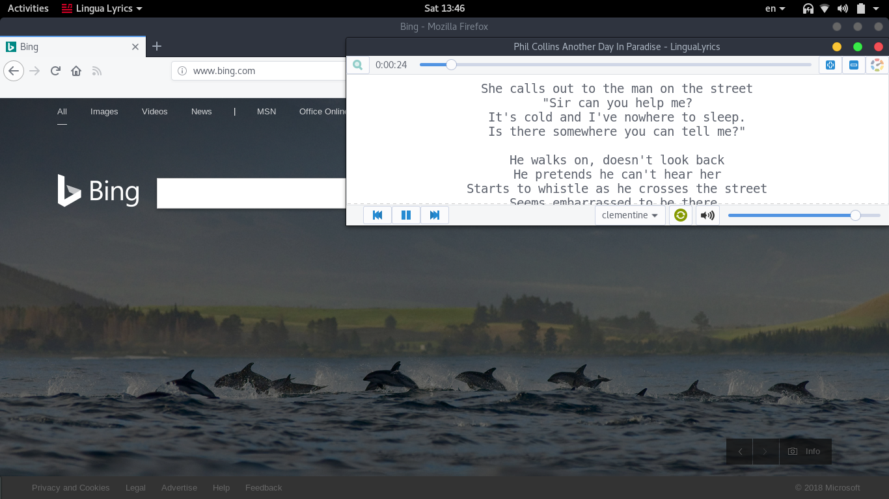

# Lingua Lyrics

Lingua Lyrics is a linux app that communicates with your music player to get the current song and then shows the lyric.
It's fully compatible with clementine, try with other players it might work.(Better support in next updates ...)

## How Lingua lyrics works
  Lingua lyrics gets the title and artist from you audio file and searchs for the lyric
## My audio file doesn't have correct title and artist
  Lingua lyrics can find the correct title and artist using audiofingerprint
## INSTALLING Lingua Lyrics

Just type:

	sudo python3 ./setup.py install

## UNINSTALLING Lingua Lyrics

Just type:

	sudo python3 ./uninstall.py

## TODO
- [x] GUI
- [x] Package the app
- [ ] Search in multiple lyric sources
- [ ] Test with other player like VLC, Smplayer, Rhythmbox, Spotify,...
- [ ] Translation of words 
- [x] Find correct lyric with audio fingerprint
- [ ] Show all available lyrics and choose between them
- [ ] Download the cover art
- [ ] Offline view

## License

GNU General Public License v3.0

LinguaLyrics icon made by <a href="http://www.freepik.com" title="Freepik">Freepik</a> from <a href="https://www.flaticon.com/" title="Flaticon">www.flaticon.com</a> is licensed by <a href="http://creativecommons.org/licenses/by/3.0/" title="Creative Commons BY 3.0" target="_blank">CC 3.0 BY</a>

Copyright © 2018, Habib Kazemi
